# Musical Examples and Visualizations to Accompany "Echoes of Josquin:  Palestrina's Missa Benedicta es and the Digital Ear"

## Richard Freedman (Haverford College, USA)

This repository contains musical examples and visualizations that accompany the book "Echoes of Josquin: Palestrina's Missa Benedicta es and the Digital Ear" by Richard Freedman. Many of them are interactive, and produced with [CRIM Intervals tools](https://github.com/HCDigitalScholarship/intervals), a software package developed by the author. 

<!--
 Test 1: Root relative 
[Test 1](./josquin_benedicta_ngrams_visualization.html)

 Test 2: Subfolder relative 
[Test 2](palestrina_josquin/josquin_benedicta_ngrams_visualization.html)

 Test 3: Absolute path 
[Test 3](/palestrina_josquin/josquin_benedicta_ngrams_visualization.html)

Test 4: Full URL 
[Test 4](https://richardfreedman.github.io/palestrina_josquin/josquin_benedicta_ngrams_visualization.html)

SVG model

-->
### Figures 

#### Figure 1.  Santa María’s Fugas

How to create fugas at different pitch and time intervals, from Tomás de Santa María, Arte de tañer fantasía (Valladolid, 1565), II, fol 65r-v (Book 2, Chapter 33).

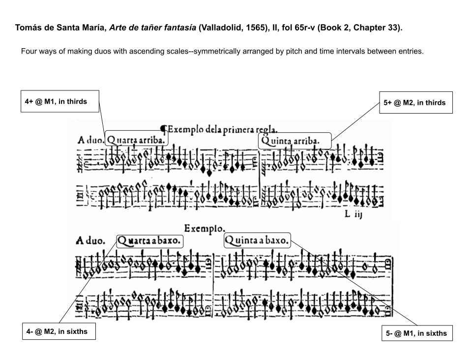

#### Figure 2.  Schubert’s Presentation Types

Schubert’s Presentation Types in Graphical-Schematic Form.  Matching black traces are meant to suggest matching soggetti.  The small boxes around the graphical patterns are meant to represent repeating harmonic modules.

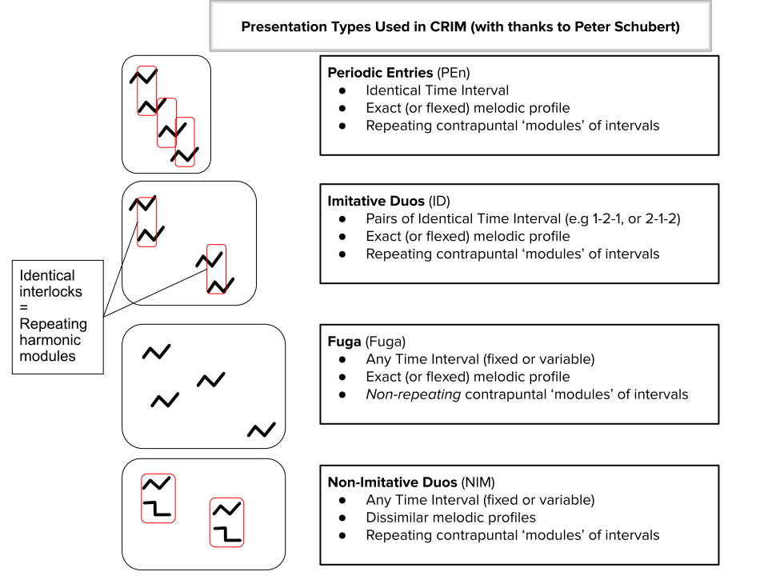

#### Figure 3.  Schematic view of a CRIM Relationship

Schematic view of a CRIM Relationship, showing annotated scores and observer’s claim about the patterns and type of transformation.  View online at:  https://crimproject.org/relationships/1407/ 

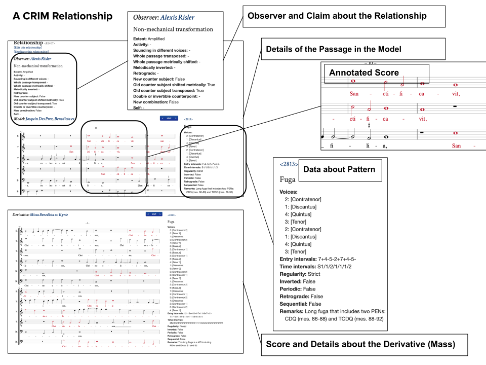

#### Figure 4. Phrase 3E in graphical notation and as tabular data in CRIM Intervals

Phrase 3E in graphical notation and as tabular data in CRIM Intervals.  Horizontal staves are transformed as vertical columns. This table shows only pitch information, but all music features (durations, lyrics, intervals, patterns of intervals) can be transformed in this way, and combined for sophisticated analysis.

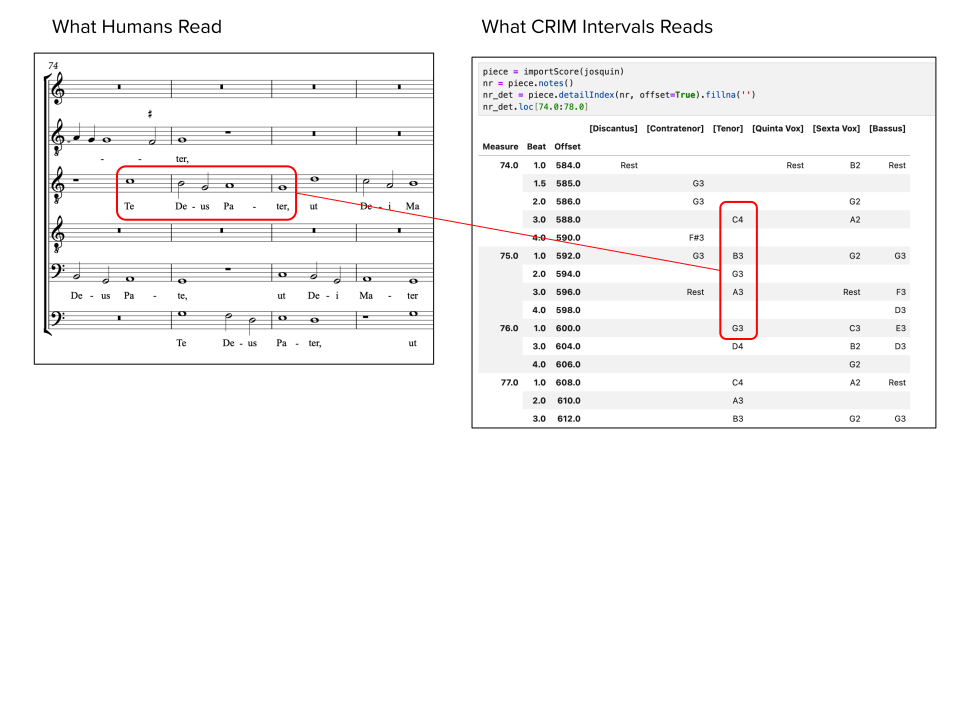

#### Figure 5.  Visual epresentation of the weighted distribution of notes

Visual representation of the weighted distribution (according to the relative duration of all notes of a given pitch class) in Josquin’s motet and Palestrina’s Kyrie.  Produced with CRIM Intervals (https://github.com/HCDigitalScholarship/intervals). 

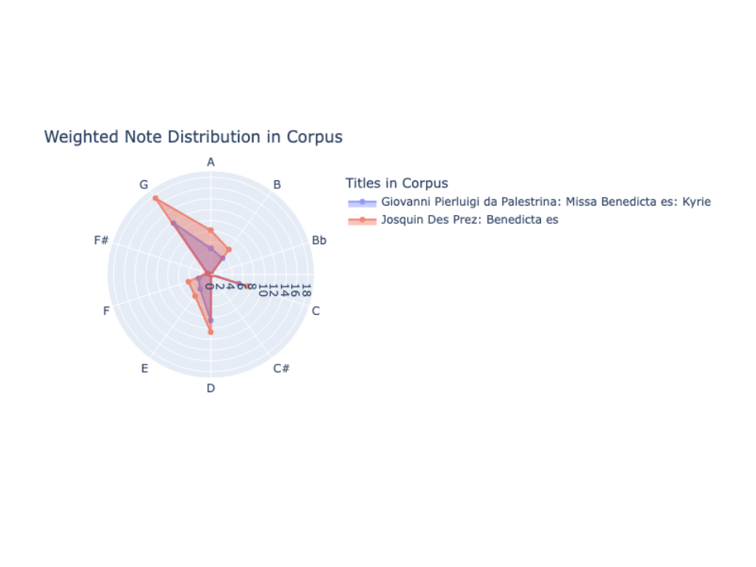

[**→ View Interactive Version**](https://richardfreedman.github.io/palestrina_josquin/Corpus_Note_Plot_Kyries.html)

*Click the link above to explore the full interactive chart in a new tab.*

#### Figure 6.  CRIM nGrams

Two instances of Phrase 3E of Josquin’s motet, as ‘nGrams’ of melodic intervals.  The temporal distances between successive entries can be calculated via the “offset’ column which provides a mathematical index of the position of each event in each piece.

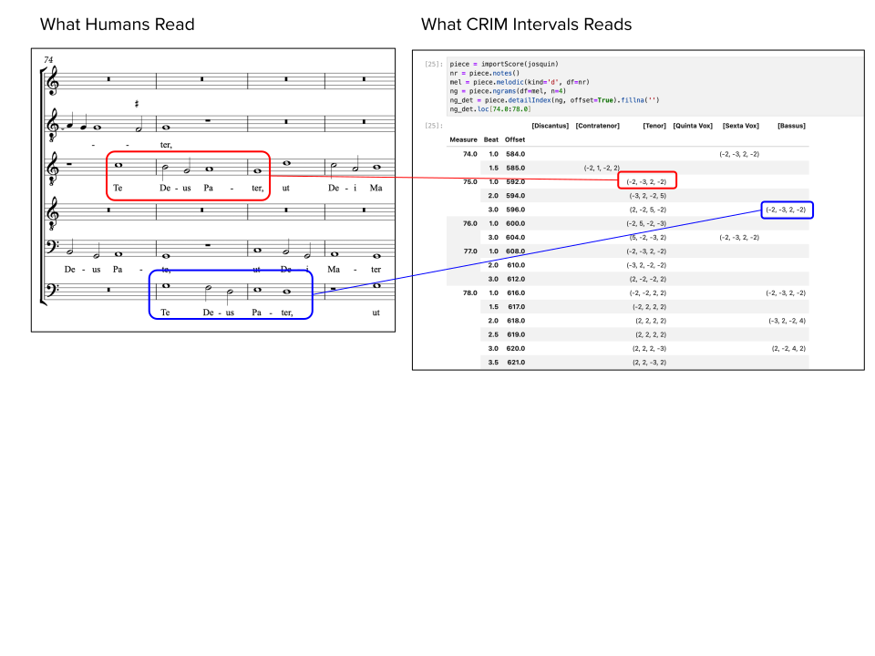

#### Figure 7.  nGrams in Josquin's Motet

CRIM Intervals chart representing the melodic nGrams in Josquin's motet. The left edge of the chart represents the beginning of the piece; the right edge is the end. The voice parts are aligned from top to bottom in a score-like arrangement. The multiple repetitions of Phrases 3E/F and 4E/F can clearly been seen at the center of the chart.

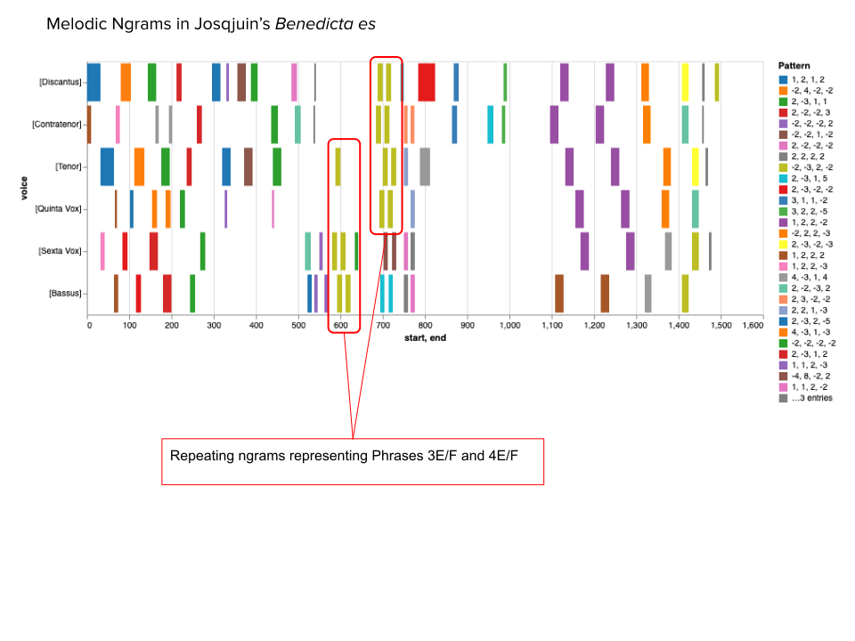

[**→ View Interactive Version**](https://richardfreedman.github.io/palestrina_josquin/josquin_benedicta_ngrams_visualization.html)

*Click the link above to explore the full interactive chart in a new tab.*

#### Figure 8.  Shared melodic nGrams in Josquin’s motet and Palestrina’s Kyrie

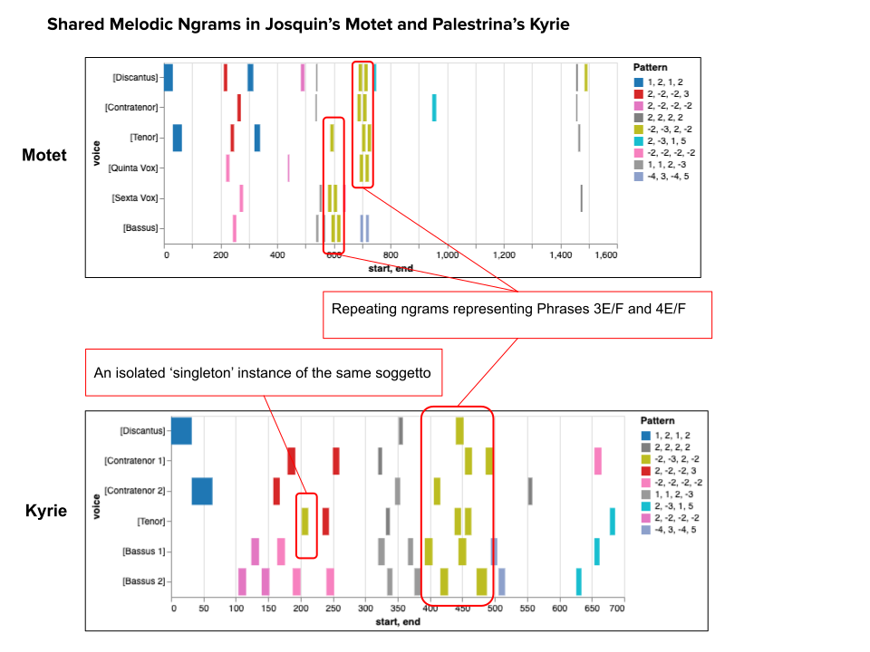

Shared melodic nGrams (diatonic, length of 4 intervals) in Josquin’s motet and Palestrina’s Kyrie; matching colors indicate matching nGrams. The marked sections show concentrations of closely repeated entries of Phrase 3E/F and 4E/F motives, along with an example of a what Milsom terms a ‘singleton’ (statement without interlock).  

[**→ View Interactive Version**](https://richardfreedman.github.io/palestrina_josquin/josquin_palestrina_kyrie_comparison.html)

*Click the link above to explore the full interactive chart in a new tab.*

#### Figure 9.  Logical Flow of Presentation Type Classification System

Schematic diagram of presentation type classification system with CRIM Intervals

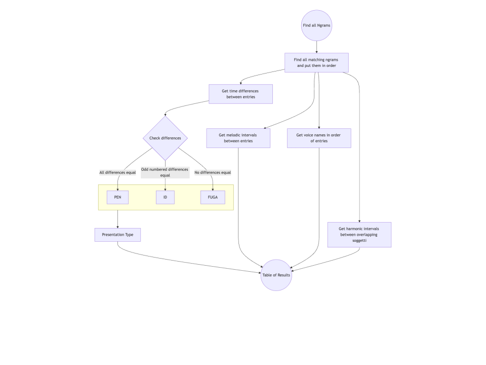

#### Figure 10.  Sample Data for Fuga Pair

CRIM Intervals assembles details about each pair of entries of the given fuga soggetto, recording information about the time and pitch distances between entries and the harmonic nGrams they form through their interlock.

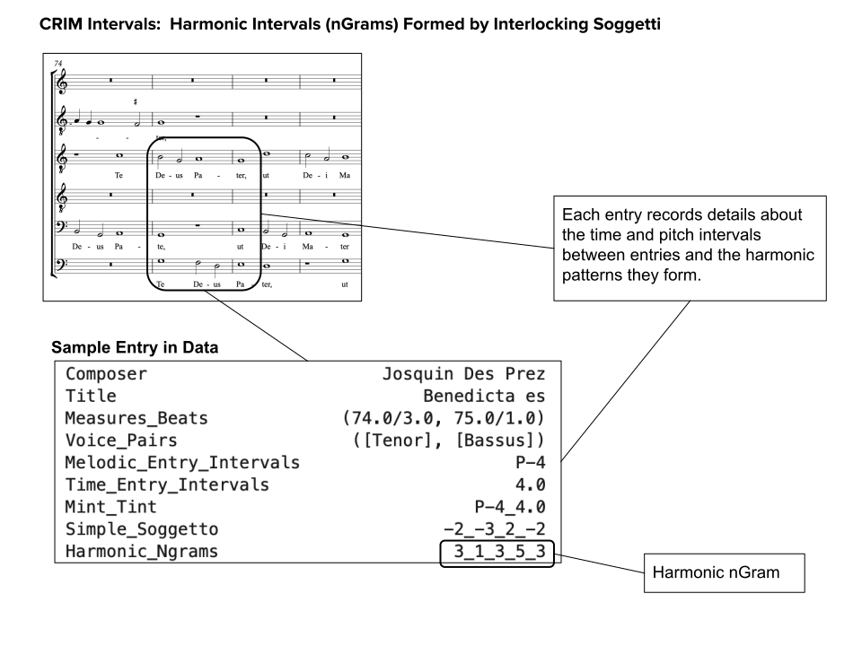

#### Figure 11. Scatterplot of Fuga Pair Data

Scatter Plot of Two-Voice Fugas made with Phrase 3E Soggeto in the Complete Benedicta es Corpus.  The various pairings of melodic and time intervals between entries is in the y-axis; the harmonic nGrams produced by the interlocks are in the x-axis. Morales and Palestrina invent an large number of new interlocks with Josquin’s soggetto; all three share but a single one. For an interactive color version of the plot (including data for all the composers in the corpus) see

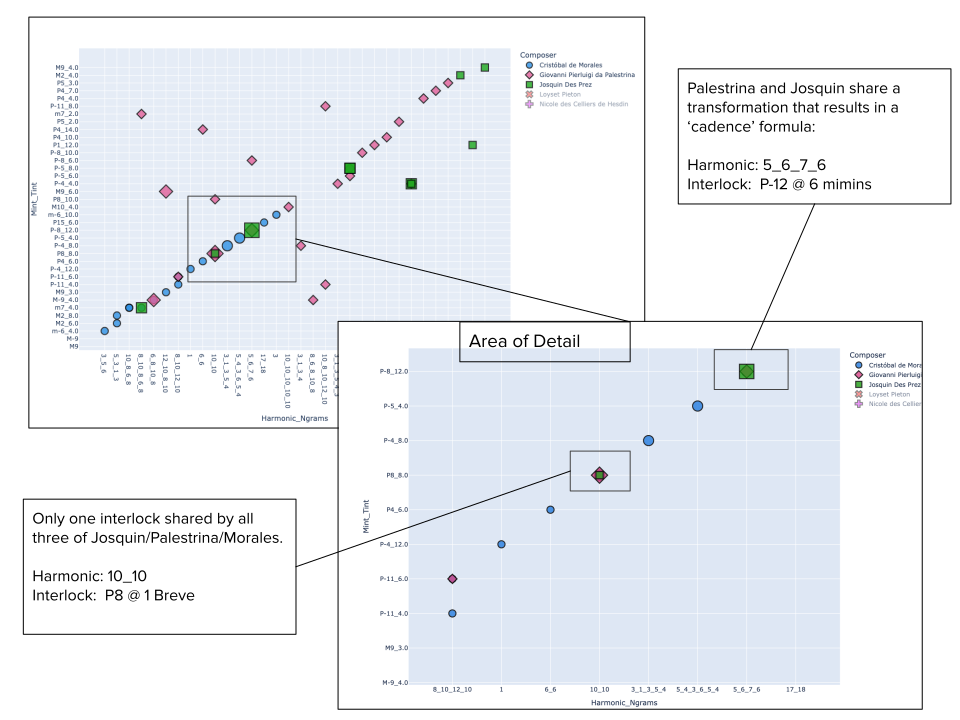

### Musical Examples

#### Example 1:  Related Melodic Phrases in Notker’s Benedicta es

Related Melodic Phrases in Notker’s Benedicta es.  Modern edition from The CRIM Project (url: https://crimproject.org/pieces/CRIM_Model_0022), based on Boston, Museum of Fine Arts, Ms 80.504, fols. 112v - 113v, a sequentiary compiled at the Convent of St. Louis de Poissy some time during the 14th century.  See https://collections.mfa.org/objects/53348/sequentiary?ctx=0e8a4040-38a6-4ee2-b8ad-24f2a8266df9&idx=67

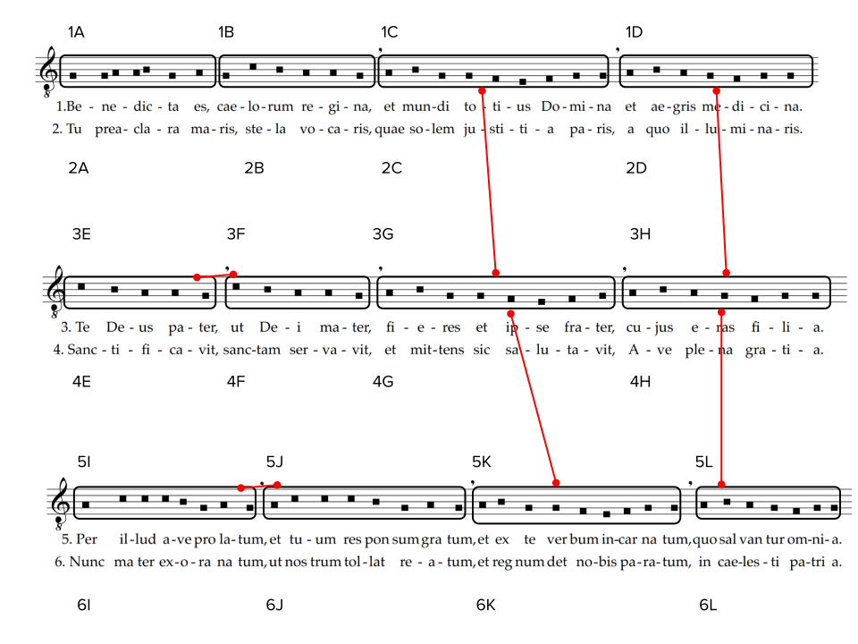

#### Example 2:  Complementary fugas from Mouton’s Benedicta es

Complementary fugas based on Phrases 1D and 5L in the Superius and Tenor parts of  Mouton’s Benedicta es, mm 17-21 and 105-08.  The Altus and Bassus parts are omitted for clarity.  For a complete edition of the work see url:  https://crimproject.org/pdf/CRIM_Model_0021.pdf. 

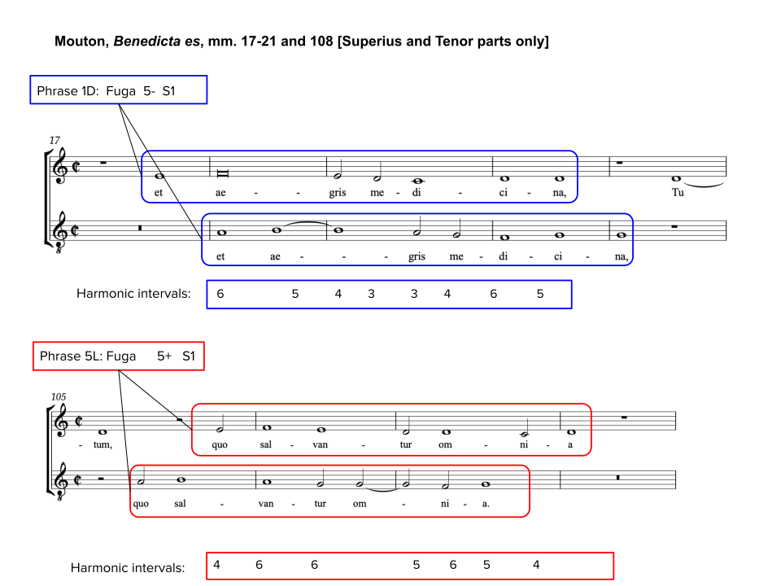

#### Example 3:  Contrasting fugas in Josquin’s Benedicta es

Contrasting fugas based on the same melodic idea from Notker’s sequence, as seen in Josquin’s Benedicta es, mm. 108-13 and 136-45.  Phrase 5I is set as a florid fuga for two upper parts; Phrase 6I (which is the same tune) is treated in a contrasting meter, simpler melodic style, but as a complex set of interlocking entries for all six voices. The Bassus is what Milsom could term “flexed”, since it follows a similar profile but with various intervallic (or durational) changes. The discantus, tenor, quinta vox and sexta vox form what Schubert would call a pair of Imitative Duos. 

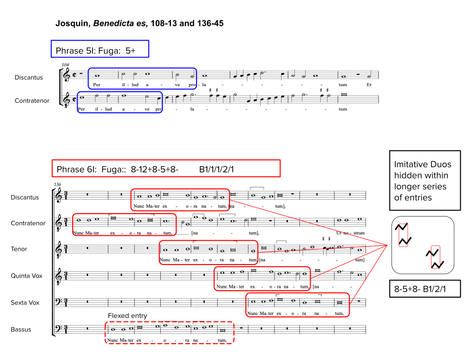

#### Example 4: Fugas in Mouton's Benedicta es

Fugas and hidden presentation types in Phrases 4E and 4F of Jean Mouton's, Benedicta es, mm. 62-7. For a complete edition of the work see url: [CRIM Model 0021](https://crimproject.org/pdf/CRIM_Model_0021.pdf).

#### Example 5: Fugas and hidden Imitative Duos in Josquin’s Benedicta es

Fugas and hidden Imitative Duos in Phrases 3E and 3F of Josquin’s Benedicta es, mm. 72-79.   There are also two ‘dovetail’ cadences in the passage:  one in measure 73 (where the Sexta vox enters an octave below the C in the Quinta vox) and in measure 75 (where the Bassus enters an octave above the G in the Sexta vox).

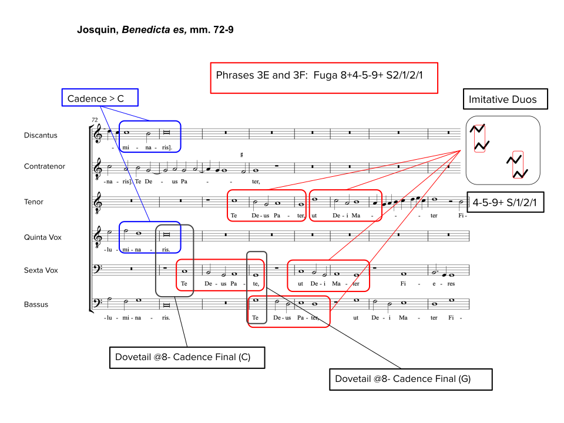

#### Example 6: Fugas and hidden presentation types in Josquin’s Benedicta es

Fugas and hidden presentation types in Phrases 4E and 4F of Josquin’s Benedicta es, mm. 86-92.  The first entry (in the quinta vox) makes a new dovetail with the cadence to G between the tenor and sexta vox.

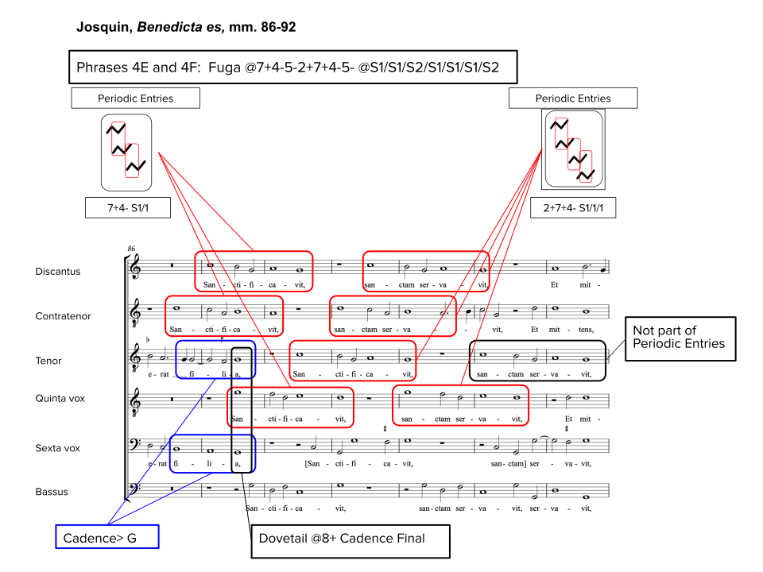

#### Example 7:  The Kyrie of Palestrina’s Missa Benedicta es

The Kyrie of Palestrina’s Mass, showing the first of over two-dozen statements of the Phrase 3E/F motive from Josquin’s motet.  The dovetail entry around the cadence recalls that found in the motet.  The various interlocks of the soggetto include a recombination of the Periodic Entry found there (same melodic intervals, but in a new order).

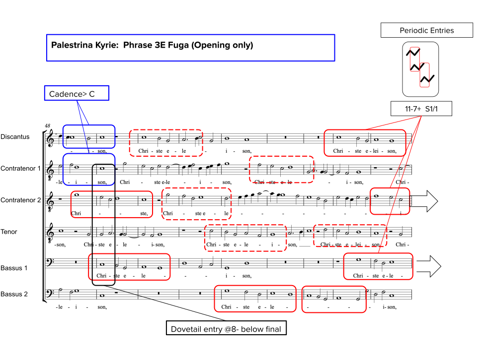

