## Musical Examples and Visualizations to Accompany "Digital Tonalities:  Exploring The Sounds of the Renaissance Music through the Imitation Mass"

## Richard Freedman (Haverford College, USA)

This repository contains musical examples and visualizations that accompany "Digital Tonalities:  
Exploring The Sounds of the Renaissance Music through the Imitation Mass", published in *Die Tonkunst*, 20 (2026). Many of them are interactive, and produced with [CRIM Intervals tools](https://github.com/HCDigitalScholarship/intervals), a software package developed by the author. 

<!--
 Test 1: Root relative 
[Test 1](./josquin_benedicta_ngrams_visualization.html)

 Test 2: Subfolder relative 
[Test 2](palestrina_josquin/josquin_benedicta_ngrams_visualization.html)

 Test 3: Absolute path 
[Test 3](/palestrina_josquin/josquin_benedicta_ngrams_visualization.html)

Test 4: Full URL 
[Test 4](https://richardfreedman.github.io/palestrina_josquin/josquin_benedicta_ngrams_visualization.html)

SVG model

-->
## Figures 

### Figure 1.  The Title Page of Claudin’s **Missa Voulant honneur** (Paris, 1556)

The title page of Claudin’s *Missa Voulant honneur* (Paris, 1556).  For a complete digital facsimile, see URL:  https://gallica.bnf.fr/ark:/12148/btv1b55008888c.  The central engraving was reused in each of the other volumes from the series, and in a set of Magnificats published by Du Chemin.

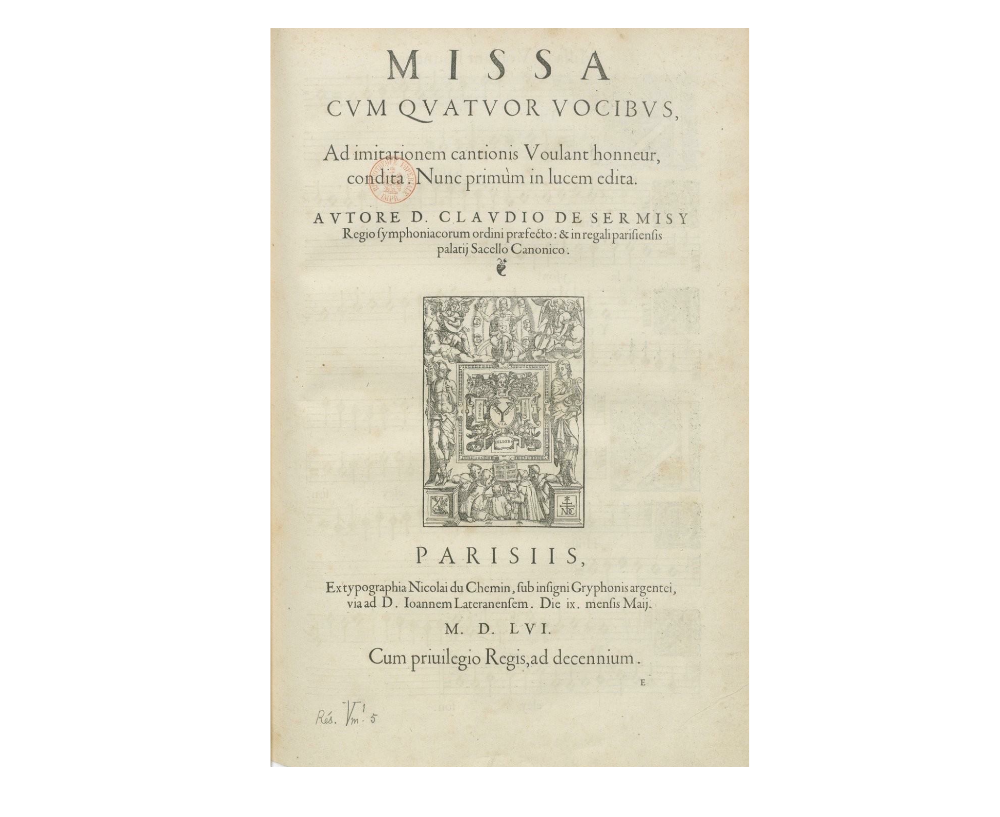

---

### Figure 2.  The Eight Tons According to Michel de Menehou

The Eight Tons According to Michel de Menehou, from the *Nouvelle instruction familiere* of 1558, chapters 14 and 15.  The small letters a, b, c, and d refer back to prose explanations in the body of the treatise, which explain the relationships among the finals, ranges, and »dominantes« for each example, as summarized here.

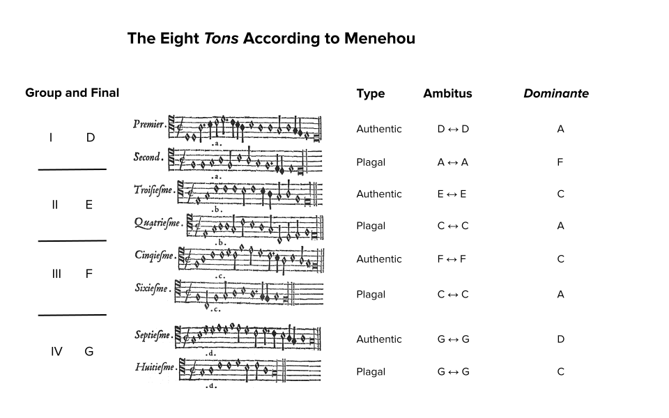

---

### Figure 3.  Three Representations of the First Phrase of the Tenor of the Kyrie Movement of Claudin de Sermisy's **Missa Voulant honneur**

Three representations of the first phrase of the Tenor of the Kyrie movement of Claudin’s *Missa Voulant honneur*:  The original source, a modern transcription, and a portion of the XML (Music Encoding Initiative format) encoding.  For the complete MEI file, see: https://crimproject.org/mei/CRIM_Model_0012.mei.  

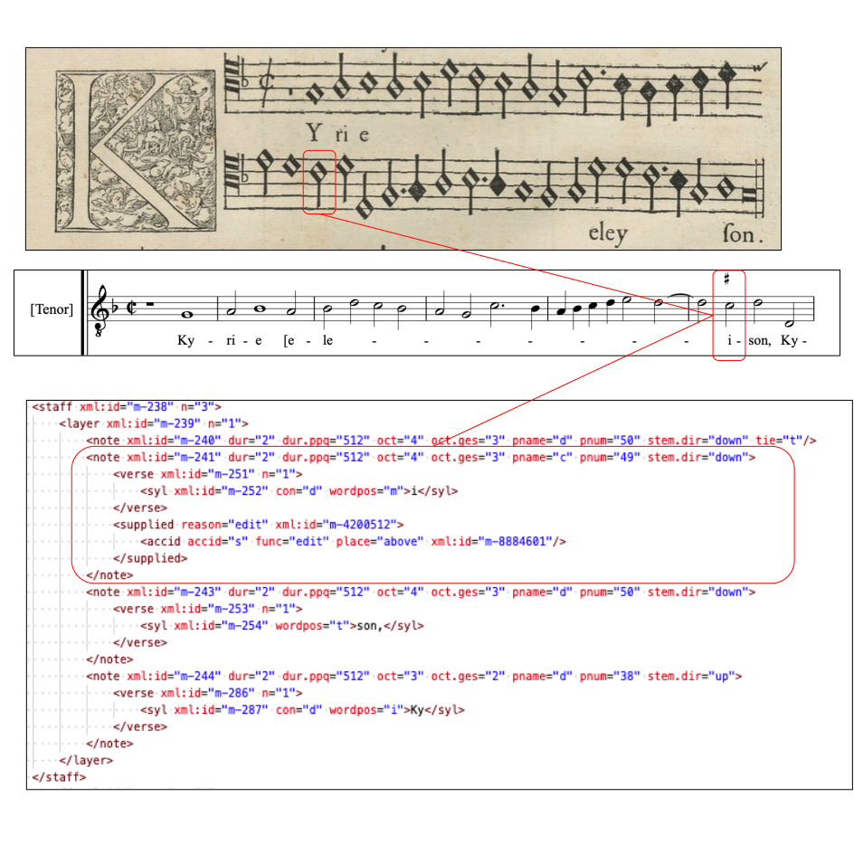

---

### Figure 4.  Claudin's Kyrie:  Table of Notes by Durational Weight

Table of notes by durational weight, derived from table of notes and table of durations in the Kyrie of Sermisy's Mass.

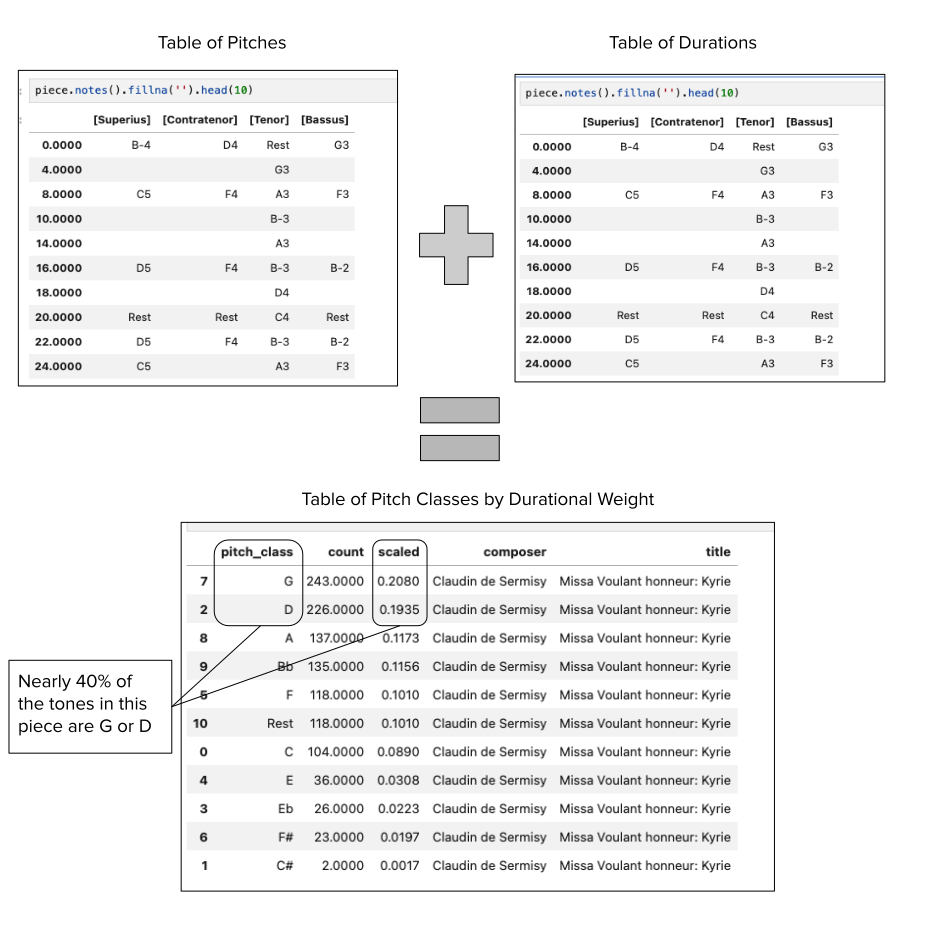

---

### Figure 5.  Weighted Note Distributions for Sandrin's chanson and the Mass Movements by Sermisy Based on It

Weighted note distributions for the chanson (on the left) and then including all the Mass movements (on the right).  The pieces are nearly identical. 

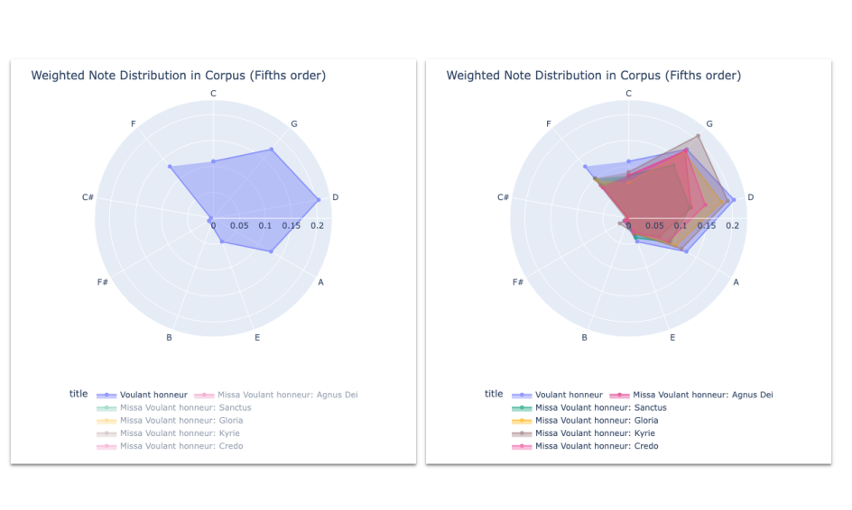

[**→ View Interactive Version**](html_figures/Tonalities_Fig_5.html)

*Click the link above to explore the full interactive chart in a new tab.*

---

### Figure 6.  Voice Ranges in the Chanson and Mass Movements

Chart showing voice ranges of *Voulant honneur* in comparison with various movements of Sermisy’s Mass.  The voices are numbered from V1 (highest in score) to V4 (or V5 in the case of the Agnus dei; lowest in the score).  Adjacent voice parts occupy complementary authentic or plagal ranges for the given final. 

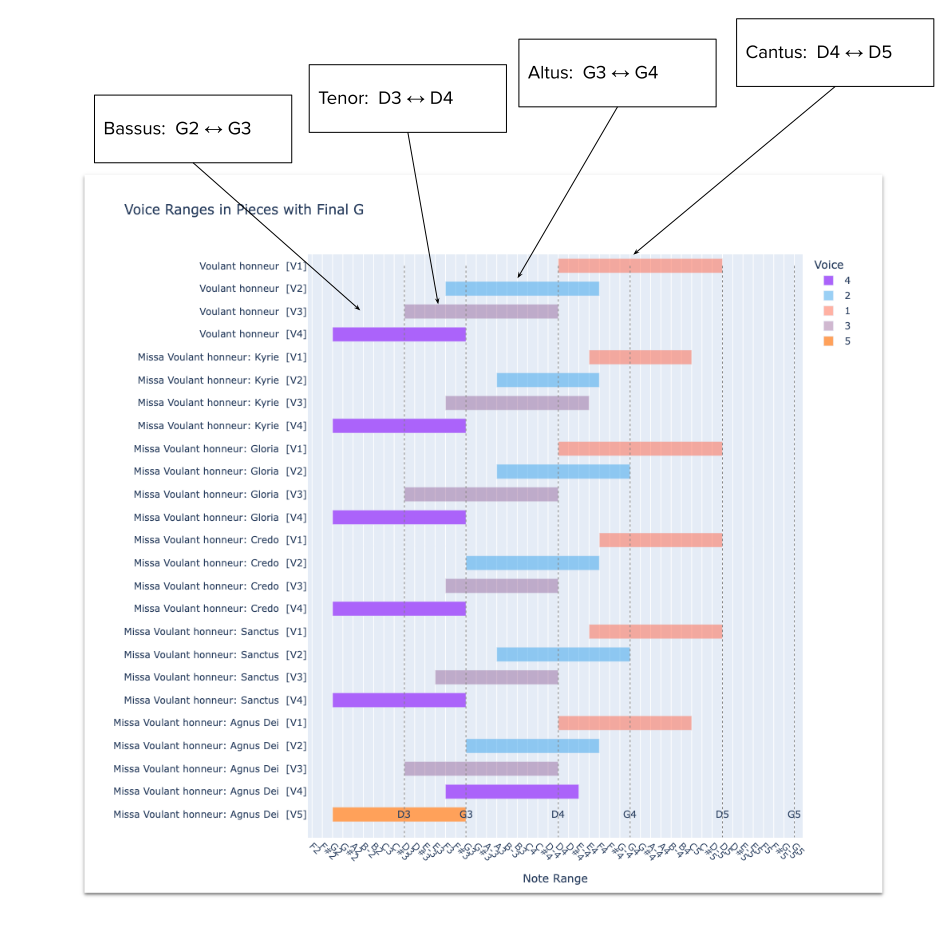

[**→ View Interactive Version**](html_figures/Tonalities_Fig_6.html)

*Click the link above to explore the full interactive chart in a new tab.*

---

### Figure 7.  Contrapuntal Ngrams as Classified Cadences

Contrapuntal Ngrams as Classified Cadences.  Authentic cadence to G correctly identified, including voice roles for each voice in the score, from top to bottom.

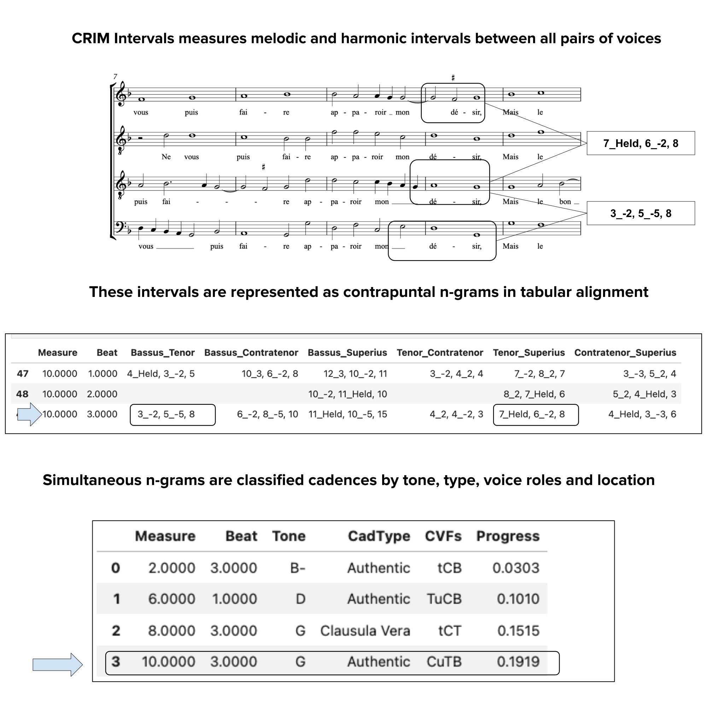

---

### Figure 8.  Comparing the Progress of Cadences in the Chanson and the Kyrie

Comparing the Progress of Cadences in the Chanson and the Kyrie. The left edge of each chart represents the start of each composition; the right edge is the end.  Created with CRIM Intervals.

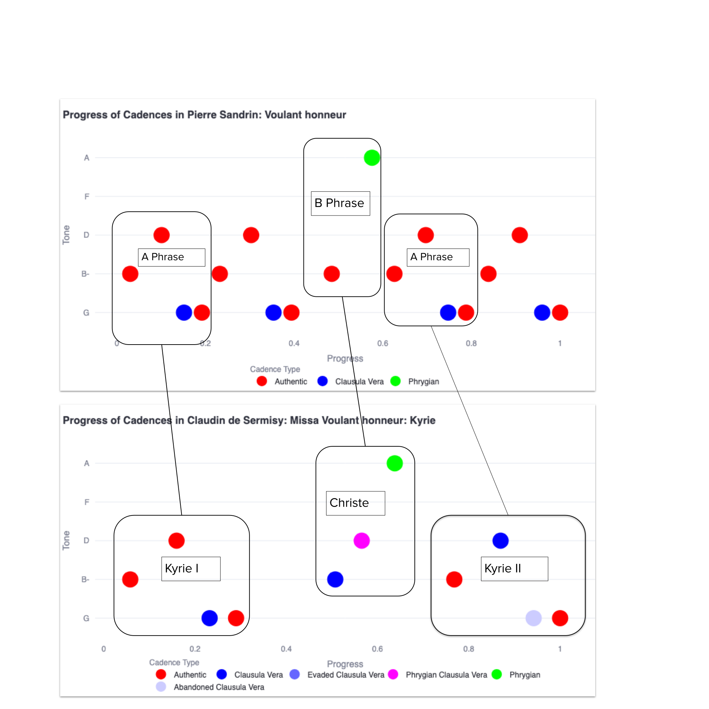

[**→ View Interactive  Version of Chanson Progress Plot**](html_figures/Tonalities_Fig_8a.html)

[**→ View Interactive Version of Kyrie Progress Plot**](html_figures/Tonalities_Fig_8b.html)

*Click the link above to explore the full interactive charts in new tabs.*

---

### Figure 9.  Comparative Distribution of Cadence Tones and Types across the Corpus

Comparative Distribution of Cadence Tones and Types across the Corpus.  In the upper chart, the size of the circle corresponds to the percentage of cadences with the given final tone in each piece.  In each chart we see how the Credo, Gloria, and Sanctus movements in particular diverge from the narrow distribution heard in the chanson and Kyrie.

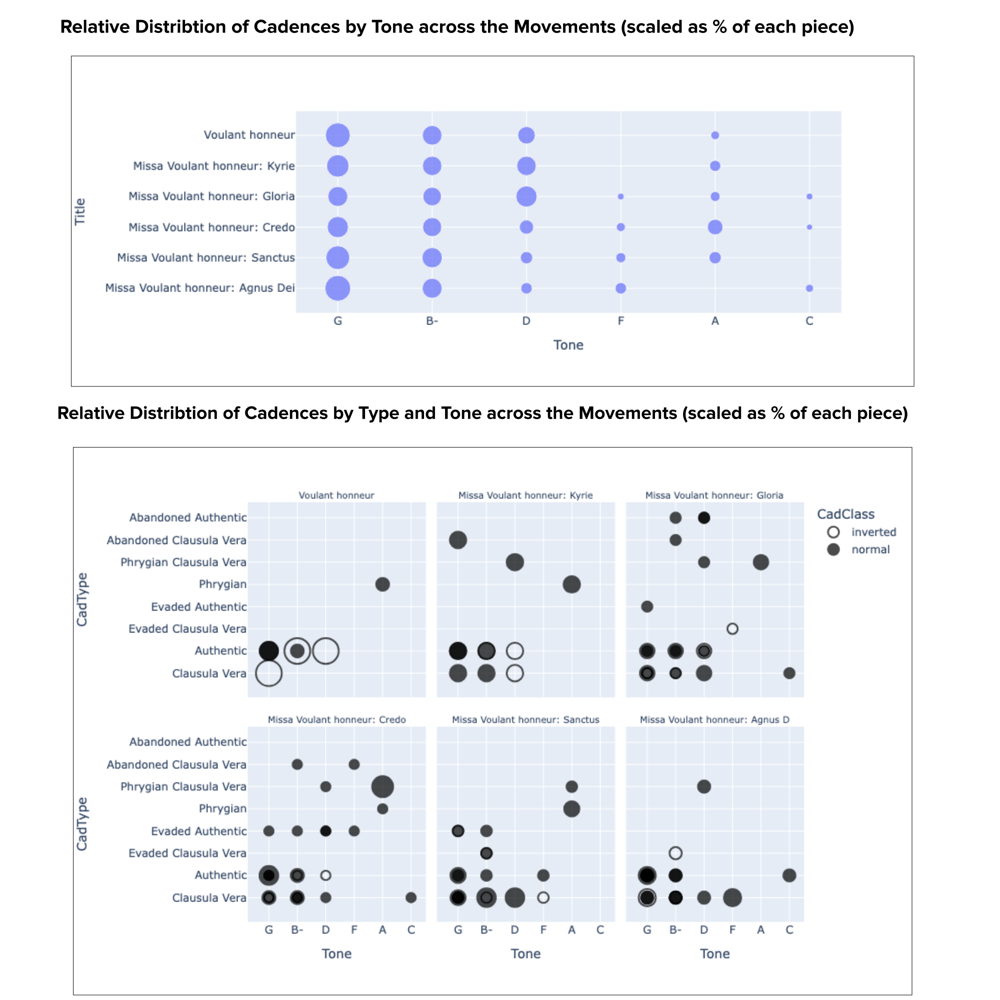

[**→ View Interactive Version of Kyrie Progress Plot**](html_figures/Tonalities_Fig_9.html)

---

## Musical Examples

### Example 1:  Four different cadence types in the opening two phrase of Sandrin’s chanson

Four different cadence types in the opening two phrase of Sandrin’s chanson.

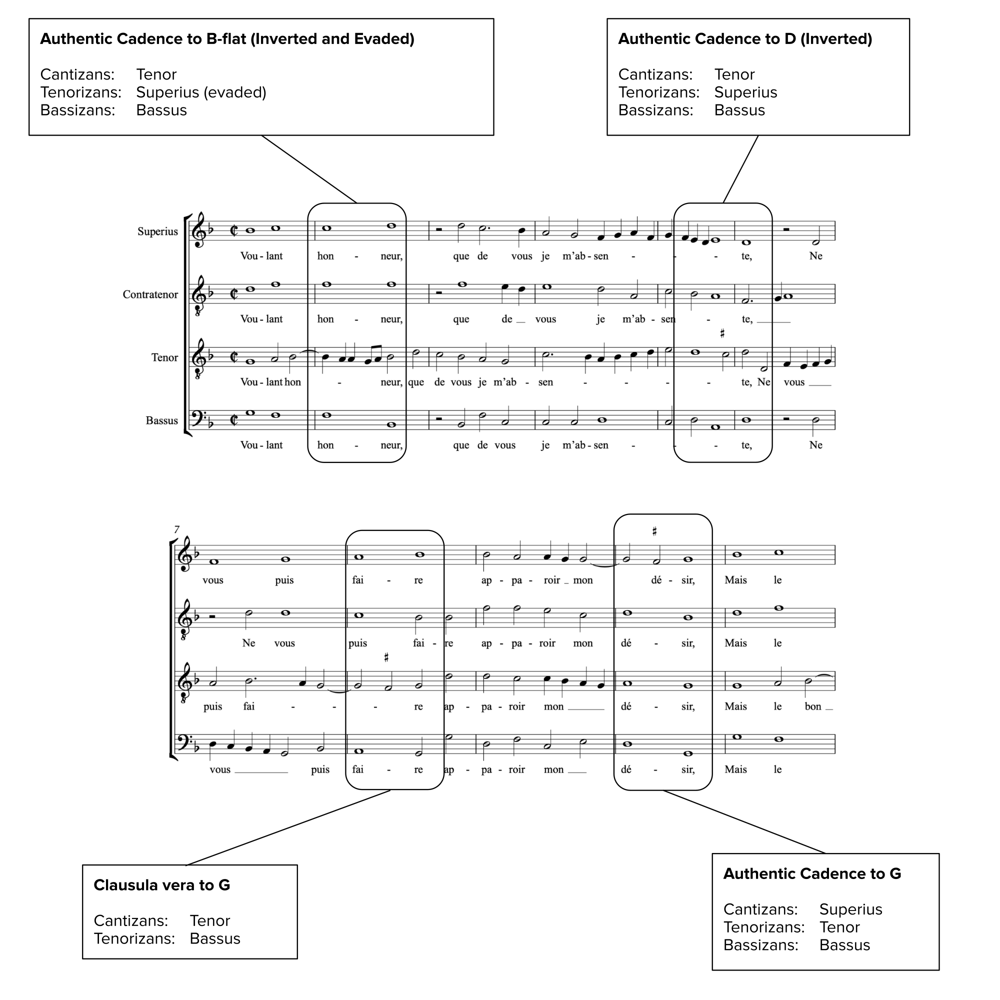

---

### Example 2.  Two cadences in the B phrase of Sandrin’s chanson

Two cadences in the B phrase of Sandrin’s chanson

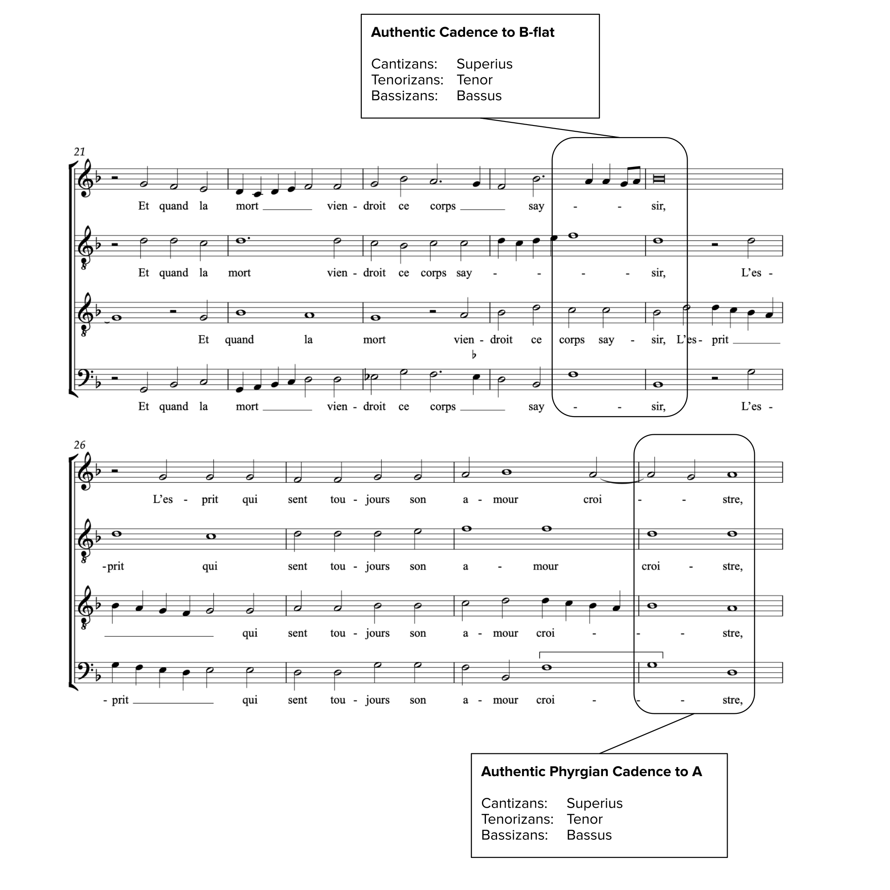

